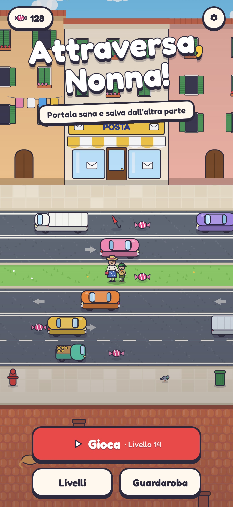
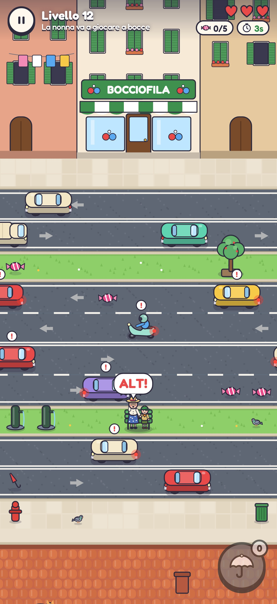
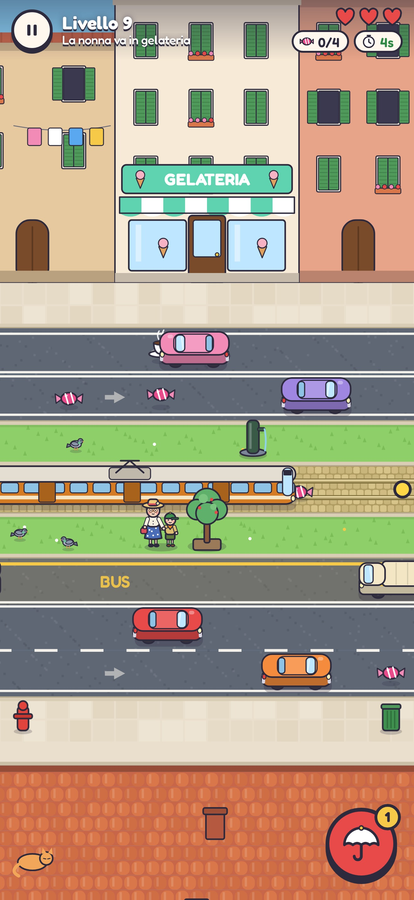
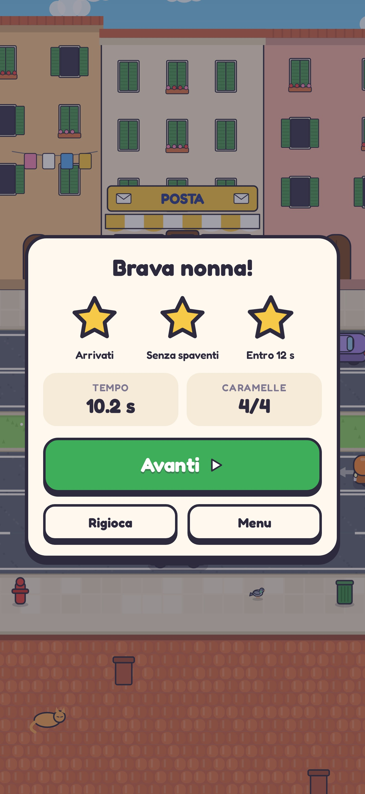

# Attraversa, Nonna!

Gioco arcade per iPhone: accompagni la nonna (per mano a un piccolo scout)
dall'altra parte della strada, tra auto, scooter, autobus, bici e tram. È pensato
per l'App Store: funziona offline, non raccoglie dati e non chiede permessi.

| Titolo | Ombrello | Tram | Vittoria |
|---|---|---|---|
|  |  |  |  |

## Come si gioca

- **Tocca** lo schermo per fare un passo avanti; **scorri** a destra, a sinistra
  o indietro per spostarti.
- Le auto non investono mai la nonna: inchiodano all'ultimo, suonano il clacson
  e lei si arrabbia ("Mascalzone!"). Ogni spavento costa un cuore; con tre
  spaventi la nonna torna a casa.
- **L'ombrello** (bottone rosso) ferma per qualche secondo i veicoli vicini.
  Il tram però non si ferma per nessuno: quando il semaforo lampeggia, aspetta.
- Per strada ci sono **caramelle** (servono a sbloccare i vestiti della nonna
  nel Guardaroba), **caffè** (passo più veloce) e **ombrelli di scorta**.
- Ogni livello vale fino a 3 stelle: arrivare, arrivare senza spaventi,
  arrivare entro il tempo indicato.

I livelli sono generati in modo deterministico dal loro numero: il livello 7 è
sempre lo stesso, per tutti. Le novità arrivano gradualmente (livello 2
ombrello, 3 scooter e spostamenti laterali, 4 piste ciclabili, 5 corsie degli
autobus, 6 tram), poi crescono velocità, densità e numero di carreggiate.

## Tecnologia

- **TypeScript + Canvas 2D**, senza motori di gioco: il bundle JavaScript pesa
  ~35 KB compressi.
- **Capacitor 8** impacchetta il gioco come app iOS nativa (WKWebView, con
  vibrazione e salvataggi nativi). Tutto è dentro il bundle: nessuna rete.
- Grafica e musica sono **generate dal codice** (disegno vettoriale e Web
  Audio), quindi niente file di terze parti da licenziare. Unico asset esterno:
  il carattere Fredoka (SIL Open Font License).

### Fluidità

- Veicoli, arredo e oggetti sono disegnati una sola volta in sprite; lo sfondo
  del livello è pre-renderizzato a fette. A ogni frame si copiano immagini.
- Simulazione e disegno sono separati; i movimenti dipendono dal tempo reale,
  quindi il gioco è fluido a 60 e a 120 Hz.
- Misure con `npm run perf` (Chromium senza GPU, livello 24): **60 fps stabili**,
  simulazione 0,03 ms e disegno 0,6 ms per frame.
- Se un telefono non tiene i 60 fps per più di un secondo, il gioco abbassa da
  solo la risoluzione interna (qualità adattiva). Con la CPU rallentata 4× il
  frame mediano torna a 16,7 ms.

## Struttura

```
src/
  levels.ts        generatore dei livelli (deterministico)
  sim.ts           simulazione pura: traffico, collisioni, ombrello, raccolta
  render/          disegno: sfondi, veicoli, personaggi, effetti
  audio.ts         effetti sonori e musica sintetizzati (Web Audio)
  ui.ts, style.css menu, HUD, guardaroba, impostazioni
  input.ts         tocchi, trascinamenti e tastiera
  storage.ts       salvataggi (Preferences su iOS, localStorage sul web)
  native.ts        vibrazione e barra di stato
tests/             unit test e un bot che gioca i livelli
scripts/           icona, screenshot App Store, misure di fluidità
ios/               progetto Xcode generato da Capacitor (già configurato)
docs/              guida alla pubblicazione, scheda App Store, privacy
```

## Comandi

Serve Node.js 22 o più recente.

```bash
npm install
npm run dev          # gioca nel browser (anche dal telefono, sulla stessa rete)
npm test             # unit test + il bot deve vincere i livelli 1-40
npm run bot          # tabella dei livelli: tempi del bot, spaventi, ombrelli usati
npm run build        # build web in dist/
npm run build:web    # un unico file HTML giocabile in dist-web/
```

Su un Mac con **Xcode 26** o successivo:

```bash
npm run ios:sync     # build + copia nel progetto iOS
npm run ios:open     # apre Xcode: scegli il tuo iPhone e premi ▶
```

Gli script `npm run assets` (icona e schermata di avvio) e `npm run screenshots`
(immagini per l'App Store) usano Playwright: la prima volta esegui
`npx playwright install chromium`.

## Pubblicazione

La guida passo passo, con le regole dell'App Store che riguardano questo gioco,
è in [docs/PUBBLICAZIONE_APP_STORE.md](docs/PUBBLICAZIONE_APP_STORE.md). Testi,
parole chiave e risposte ai questionari sono pronti in
[docs/scheda-app-store.md](docs/scheda-app-store.md).
