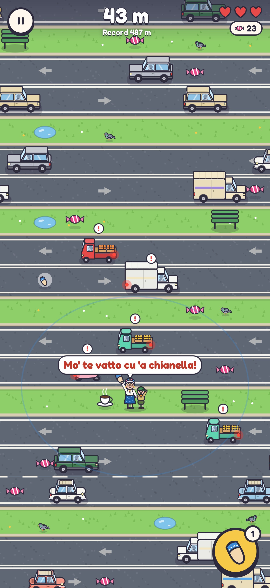
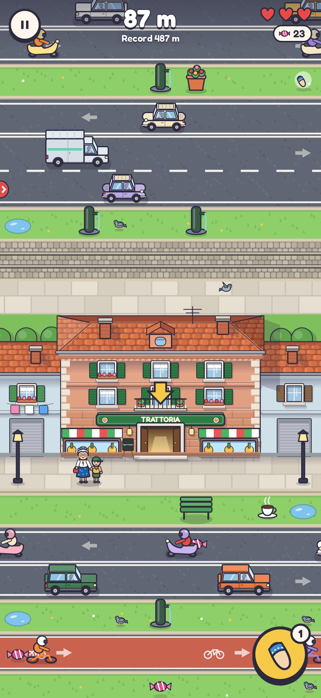
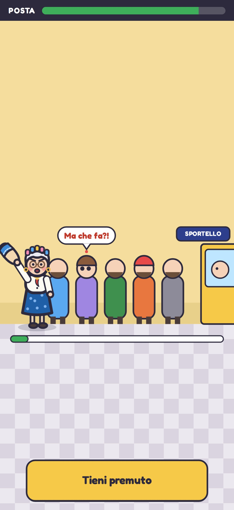
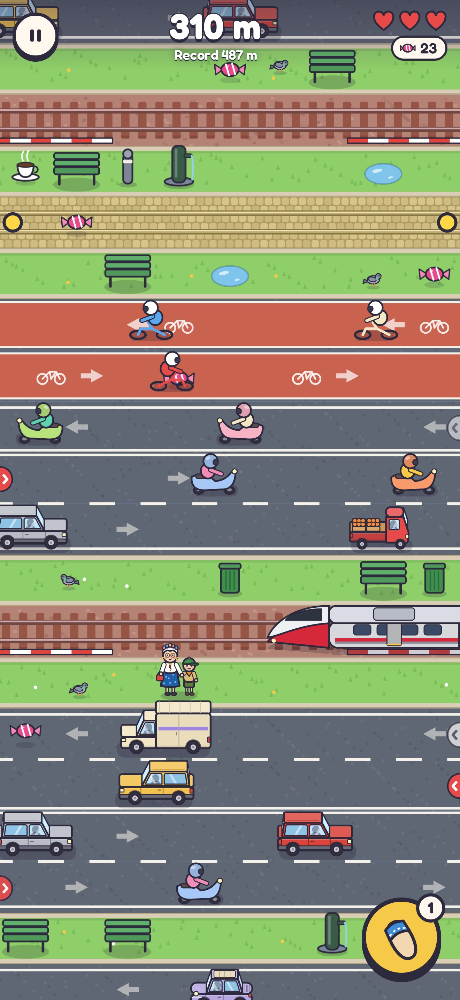
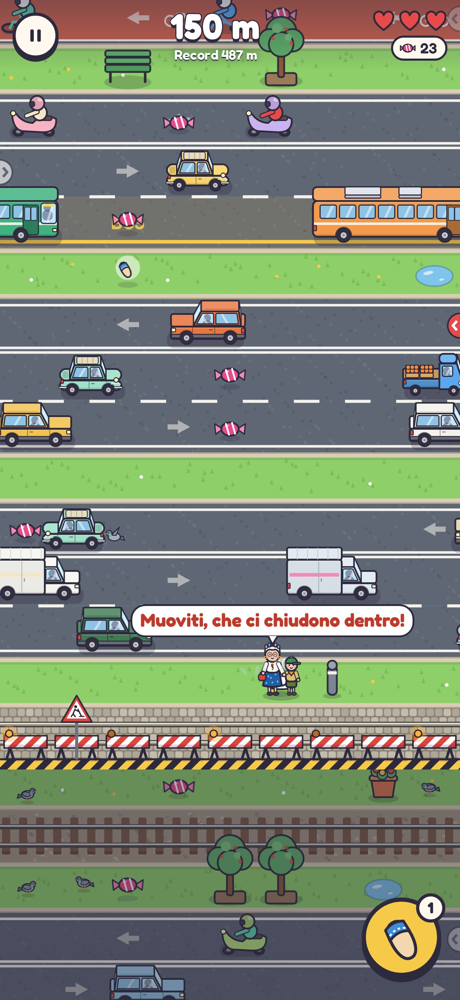
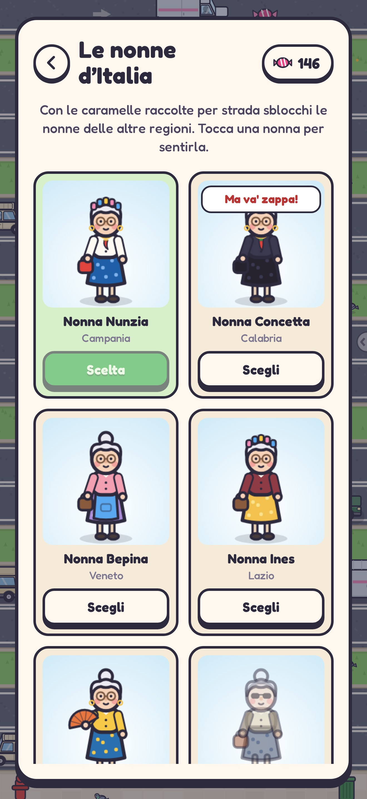

# Attraversa, Nonna!

Gioco arcade infinito per iPhone: accompagni la nonna (per mano a un piccolo
scout) il più lontano possibile, attraversando strade sempre più trafficate. Ogni
tanto c'è una sosta con un minigioco da fare con lei. È pensato per l'App Store:
funziona offline, non raccoglie dati e non chiede permessi.

| Ciabatta | Il palazzo della sosta | Salta la fila | Alta velocità | Lavori in corso | Le nonne |
|---|---|---|---|---|---|
|  |  |  |  |  |  |

## Come si gioca

- **Tocca** per fare un passo avanti; **scorri** a destra, a sinistra o indietro
  per spostarti. Ogni passo avanti è **un metro**: il punteggio è la distanza.
- **Più vai lontano, più è difficile**, un po' alla volta fin dall'inizio: i mezzi
  vanno sempre più forte (×1,9 a 250 m, ×2,8 a 500 m, ×4,6 a 1000 m, fino a ×5
  verso i 1120 m), le corsie aumentano e le novità arrivano presto: piste
  ciclabili da ~65 m, tram da ~90 m, treni da ~145 m. Da ~200 m le carreggiate si
  incastrano senza spartitraffico in mezzo, fino a cinque corsie di fila (più
  sono, più ogni corsia è rada, come nei viali veri).
- **Automobilisti di fretta**: sempre più spesso qualcuno va più forte degli
  altri, raggiunge chi gli sta davanti, inchioda e suona.
- **Spie ai bordi**: un cerchio sul bordo dello schermo avvisa che da quella parte
  sta per entrare un mezzo (rosso quando è vicino).
- **Mezzi disegnati di tre quarti**, come le nonne e i palazzi: si vede la
  fiancata intera e, sopra, cofano e tetto, così il cofano sta più basso del
  tetto e il profilo di ogni mezzo si riconosce al volo.
- **Mezzi all'italiana, senza marchi**: l'utilitaria squadrata anni '80, la
  piccola tondeggiante col tettuccio di tela, il furgoncino col cassone alto, il
  motocarro, lo scooter, il pullman, il tram. Da ~145 m arriva la **ferrovia**
  con il passaggio a livello: treni regionali e treni ad alta velocità, che vanno
  quasi il doppio e si annunciano con più anticipo.
- **Chi si ferma è perduto**: dietro la coppia ci sono i lavori in corso, ma di
  solito non si vedono. Una fila di transenne la segue di nascosto a 3 metri dal
  punto più lontano raggiunto (mai oltre l'ultimo marciapiede sicuro) e oltre non
  si torna indietro. Le transenne spuntano da terra solo quando servono: se si
  prova a tornare indietro ("Indietro non si torna!"), se ci si arriva vicino
  camminando all'indietro, o se si resta fermi senza fare un metro in più. In
  quel caso compaiono con due secondi di avviso (7 s da fermi all'inizio, 4,5 s
  più avanti), poi avanzano di una riga alla volta col cartello dei lavori (ogni
  1,6 s all'inizio, ogni 1,1 s più avanti). Se superano la coppia la strada è
  chiusa e la corsa finisce. Appena si riparte, tornano a nascondersi.
- **Per un pelo!**: se un mezzo passa proprio dove la coppia era un attimo prima
  (meno di mezzo secondo), la schivata vale caramelle bonus; più schivate di fila
  (entro 5 s) fanno la serie ×2, ×3… fino a ×5, e col treno valgono doppio. A fine
  corsa c'è il conto delle schivate.
- **Il tuo record sulla strada**: una linea a scacchi con la bandierina segna il
  punto del record; superarlo a metà corsa fa partire coriandoli e fanfara. Ogni
  100 metri c'è un piccolo applauso.
- **La voce delle nonne**: quando parlano, i fumetti si sentono in "nonnese", un
  borbottio a sillabe da cartone animato (ogni nonna ha il suo tono, e quando
  strilla è più acuto).
- Le auto non investono mai la nonna: inchiodano all'ultimo e lei le manda a quel
  paese nel suo dialetto. Ogni spavento costa un cuore; con tre spaventi la
  corsa finisce.
- **La ciabatta** (bottone giallo): la nonna la alza e chi la vede inchioda per
  qualche secondo, su tutta la carreggiata davanti (fino a cinque corsie). Tram e
  treni però non si fermano per nessuno.
- Per strada ci sono **caramelle**, **caffè** (passo più veloce), **ciabatte di
  scorta** e, raramente, **cuori**.
- **Soste**: ogni 120-180 m la strada finisce contro un palazzo, diverso per ogni
  sosta (la casa rosa della nonna, la posta gialla, la merceria lilla, la
  trattoria color terracotta). È disegnato in rilievo: corpo centrale più alto con
  tetto a padiglione di coppi, comignoli e abbaino, finestre incassate con
  davanzali, balcone e tende che fanno ombra, cantonali di pietra; ai lati due case
  più basse con il giardino dietro. Una freccia indica il portone:
  si entra da lì, si fa il minigioco a tempo e si esce dall'altra parte. Se va
  bene: caramelle e un cuore in regalo; se va male la nonna si offende (un cuore
  in meno).
  - *Il tiramisù della nonna*: ingredienti nell'ordine giusto (si rimescolano).
  - *Salta la fila alla Posta*: tieni premuto per sgattaiolare, lascia quando
    qualcuno si gira.
  - *Infila l'ago*: la nonna non ci vede e il filo trema.
  - *Mangia che sei sciupato!*: tre piatti da svuotare a suon di tocchi.
- **Le nonne d'Italia**: 20 nonne, una per regione, con vestiti, accessori e
  frasi proprie. Napoletana, calabrese e veneta sono subito disponibili; le altre
  si sbloccano con le caramelle.

## Salvataggi

Record, caramelle, nonne sbloccate e impostazioni restano sul telefono: su iOS nelle
Preferences dell'app (UserDefaults), che sopravvivono alla chiusura dell'app e al
riavvio e finiscono nei backup di iCloud. Durante la corsa record e caramelle
vengono messi al sicuro quando l'app va in background e dopo ogni sosta, così se
iOS la chiude (o la si chiude a metà strada) non si perde niente. Si perdono solo
disinstallando l'app (salvo ripristino da backup). Nell'anteprima web (artifact)
i dati stanno nel browser e possono non sopravvivere alla chiusura.

## Tecnologia

- **TypeScript + Canvas 2D**, senza motori di gioco: il bundle JavaScript pesa
  ~50 KB compressi.
- **Capacitor 8** impacchetta il gioco come app iOS nativa (WKWebView, con
  vibrazione e salvataggi nativi). Tutto è dentro il bundle: nessuna rete.
- Grafica e musica sono **generate dal codice** (disegno vettoriale e Web Audio):
  niente file di terze parti da licenziare. Unico asset esterno: il carattere
  Fredoka (SIL Open Font License).

### Fluidità

- La strada infinita si genera a pezzi, sempre uguale a parità di seme; solo le
  corsie vicine alla nonna vengono simulate.
- Lo sfondo (palazzi compresi) è disegnato in fette di 6 righe, preparate un
  attimo prima di entrare in scena (~2,5 ms l'una) e buttate quando restano
  indietro.
- Veicoli, arredo e oggetti sono sprite disegnati una volta sola.
- `npm run perf` (Chromium senza GPU, corsa che sale veloce): **60 fps stabili**,
  simulazione 0,05 ms e disegno 0,7 ms per frame.
- Qualità adattiva: se un telefono non tiene i 60 fps per più di un secondo, il
  gioco abbassa da solo la risoluzione interna.

## Struttura

```
src/
  world.ts         generatore della strada infinita e della difficoltà per metri
  sim.ts           simulazione pura: traffico, collisioni, ciabatta, lavori in corso, soste
  nonne.ts         le 20 nonne regionali: aspetto e frasi in dialetto
  minigames/       i quattro minigiochi delle soste
  render/          disegno: sfondi, piazze, veicoli, personaggi, effetti
  audio.ts         effetti sonori e musica sintetizzati (Web Audio)
  ui.ts, style.css menu, HUD, galleria delle nonne, impostazioni
  input.ts         tocchi, trascinamenti e tastiera
  storage.ts       salvataggi (Preferences su iOS, localStorage sul web)
  native.ts        vibrazione e barra di stato
tests/             unit test e un bot che corre sulla strada infinita
scripts/           icona, screenshot App Store, misure di fluidità
ios/               progetto Xcode generato da Capacitor (già configurato)
docs/              guida alla pubblicazione, scheda App Store, privacy
```

## Comandi

Serve Node.js 22 o più recente.

```bash
npm install
npm run dev          # gioca nel browser (anche dal telefono, sulla stessa rete)
npm test             # unit test + il bot deve superare i 250 m, e passare anche a 1150 e 1700 m
npm run bot          # 12 corse del bot: metri raggiunti, soste, causa di fine
npm run build        # build web in dist/
npm run build:web    # un unico file HTML giocabile in dist-web/
```

Su un Mac con **Xcode 26** o successivo:

```bash
npm run ios:sync     # build + copia nel progetto iOS
npm run ios:open     # apre Xcode: scegli il tuo iPhone e premi ▶
```

Gli script `npm run assets` (icona e schermata di avvio), `npm run screenshots`
(immagini per l'App Store) e `npm run perf` usano Playwright: la prima volta
esegui `npx playwright install chromium`.

## Le frasi delle nonne

Sono tutte in `src/nonne.ts`, una lista per nonna (`hit` quando un'auto
inchioda, `slipper` quando alza la ciabatta, `happy` quando va tutto bene). I
dialetti sono scritti "a orecchio": conviene farli rileggere a qualcuno del
posto. Regole: parolacce leggere sì, bestemmie, insulti ai morti e prese in giro
di una regione o di un gruppo no (vedi la guida alla pubblicazione).

## Pubblicazione

La guida passo passo, con le regole dell'App Store che riguardano questo gioco,
è in [docs/PUBBLICAZIONE_APP_STORE.md](docs/PUBBLICAZIONE_APP_STORE.md). Testi,
parole chiave e risposte ai questionari sono in
[docs/scheda-app-store.md](docs/scheda-app-store.md).
