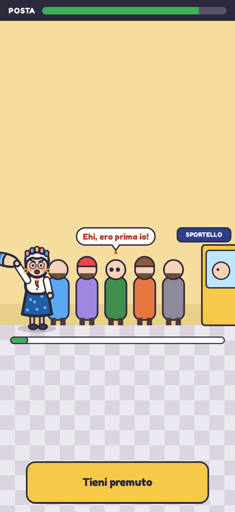
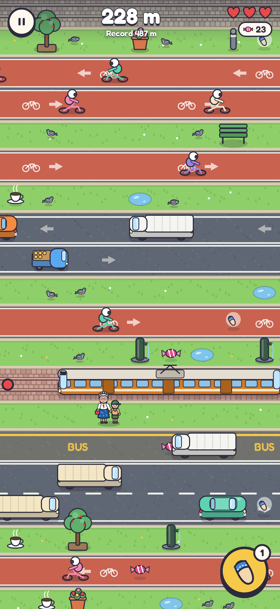
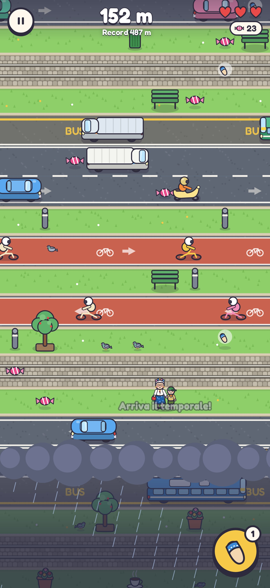
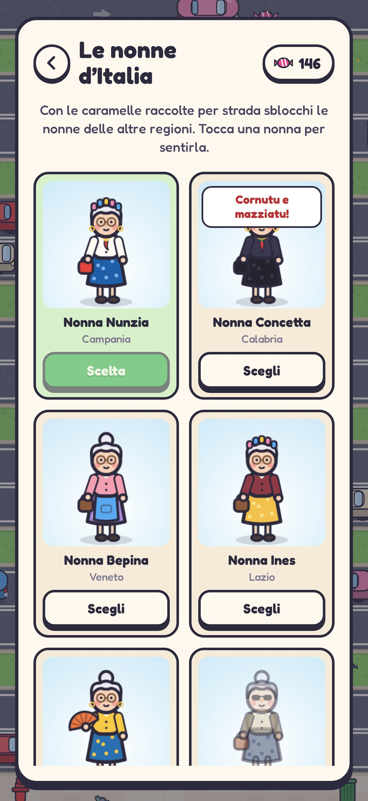

# Attraversa, Nonna!

Gioco arcade infinito per iPhone: accompagni la nonna (per mano a un piccolo
scout) il più lontano possibile, attraversando strade sempre più trafficate. Ogni
tanto c'è una sosta con un minigioco da fare con lei. È pensato per l'App Store:
funziona offline, non raccoglie dati e non chiede permessi.

| Titolo | Ciabatta | Sosta alla Posta | Tram | Temporale | Le nonne |
|---|---|---|---|---|---|
|  |  |  |  |  |  |

## Come si gioca

- **Tocca** per fare un passo avanti; **scorri** a destra, a sinistra o indietro
  per spostarti. Ogni passo avanti è **un metro**: il punteggio è la distanza.
- **Più vai lontano, più è difficile**: corsie in più, traffico più veloce, spazi
  più stretti; da ~250 m piste ciclabili e binari del tram si incastrano con le
  strade senza spartitraffico in mezzo.
- **Da dietro arriva il temporale**, sempre un po' più veloce: se raggiunge la
  nonna, la corsa finisce. Non si può restare fermi a lungo.
- Le auto non investono mai la nonna: inchiodano all'ultimo e lei le manda a quel
  paese nel suo dialetto. Ogni spavento costa un cuore; con tre spaventi la
  corsa finisce.
- **La ciabatta** (bottone giallo): la nonna la alza e chi la vede inchioda per
  qualche secondo. Il tram però non si ferma per nessuno.
- Per strada ci sono **caramelle**, **caffè** (passo più veloce), **ciabatte di
  scorta** e, raramente, **cuori**.
- **Soste**: ogni 120-180 m c'è una piazza con un minigioco a tempo. Se va bene:
  caramelle e un cuore in regalo; se va male la nonna si offende (un cuore in meno).
  - *Il tiramisù della nonna*: ingredienti nell'ordine giusto (si rimescolano).
  - *Salta la fila alla Posta*: tieni premuto per sgattaiolare, lascia quando
    qualcuno si gira.
  - *Infila l'ago*: la nonna non ci vede e il filo trema.
  - *Mangia che sei sciupato!*: tre piatti da svuotare a suon di tocchi.
- **Le nonne d'Italia**: 20 nonne, una per regione, con vestiti, accessori e
  frasi proprie. Napoletana, calabrese e veneta sono subito disponibili; le altre
  si sbloccano con le caramelle.

## Tecnologia

- **TypeScript + Canvas 2D**, senza motori di gioco: il bundle JavaScript pesa
  ~50 KB compressi.
- **Capacitor 8** impacchetta il gioco come app iOS nativa (WKWebView, con
  vibrazione e salvataggi nativi). Tutto è dentro il bundle: nessuna rete.
- Grafica e musica sono **generate dal codice** (disegno vettoriale e Web Audio):
  niente file di terze parti da licenziare. Unico asset esterno: il carattere
  Fredoka (SIL Open Font License).

### Fluidità

- La strada infinita si genera a pezzi, sempre uguale a parità di seme; solo le
  corsie vicine alla nonna vengono simulate.
- Lo sfondo è disegnato in fette di 6 righe, preparate un attimo prima di
  entrare in scena (~3 ms l'una) e buttate quando restano indietro.
- Veicoli, arredo e oggetti sono sprite disegnati una volta sola.
- `npm run perf` (Chromium senza GPU, corsa che sale veloce): **60 fps stabili**,
  simulazione 0,05 ms e disegno 0,7 ms per frame.
- Qualità adattiva: se un telefono non tiene i 60 fps per più di un secondo, il
  gioco abbassa da solo la risoluzione interna.

## Struttura

```
src/
  world.ts         generatore della strada infinita e della difficoltà per metri
  sim.ts           simulazione pura: traffico, collisioni, ciabatta, temporale, soste
  nonne.ts         le 20 nonne regionali: aspetto e frasi in dialetto
  minigames/       i quattro minigiochi delle soste
  render/          disegno: sfondi, piazze, veicoli, personaggi, effetti
  audio.ts         effetti sonori e musica sintetizzati (Web Audio)
  ui.ts, style.css menu, HUD, galleria delle nonne, impostazioni
  input.ts         tocchi, trascinamenti e tastiera
  storage.ts       salvataggi (Preferences su iOS, localStorage sul web)
  native.ts        vibrazione e barra di stato
tests/             unit test e un bot che corre sulla strada infinita
scripts/           icona, screenshot App Store, misure di fluidità
ios/               progetto Xcode generato da Capacitor (già configurato)
docs/              guida alla pubblicazione, scheda App Store, privacy
```

## Comandi

Serve Node.js 22 o più recente.

```bash
npm install
npm run dev          # gioca nel browser (anche dal telefono, sulla stessa rete)
npm test             # unit test + il bot deve superare i 250 m su più semi
npm run bot          # 12 corse del bot: metri raggiunti, soste, causa di fine
npm run build        # build web in dist/
npm run build:web    # un unico file HTML giocabile in dist-web/
```

Su un Mac con **Xcode 26** o successivo:

```bash
npm run ios:sync     # build + copia nel progetto iOS
npm run ios:open     # apre Xcode: scegli il tuo iPhone e premi ▶
```

Gli script `npm run assets` (icona e schermata di avvio), `npm run screenshots`
(immagini per l'App Store) e `npm run perf` usano Playwright: la prima volta
esegui `npx playwright install chromium`.

## Le frasi delle nonne

Sono tutte in `src/nonne.ts`, una lista per nonna (`hit` quando un'auto
inchioda, `slipper` quando alza la ciabatta, `happy` quando va tutto bene). I
dialetti sono scritti "a orecchio": conviene farli rileggere a qualcuno del
posto. Regole: parolacce leggere sì, bestemmie, insulti ai morti e prese in giro
di una regione o di un gruppo no (vedi la guida alla pubblicazione).

## Pubblicazione

La guida passo passo, con le regole dell'App Store che riguardano questo gioco,
è in [docs/PUBBLICAZIONE_APP_STORE.md](docs/PUBBLICAZIONE_APP_STORE.md). Testi,
parole chiave e risposte ai questionari sono in
[docs/scheda-app-store.md](docs/scheda-app-store.md).
